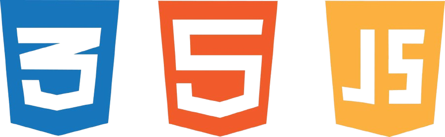

# NeoTech - Fluxar

📍A NeoTech nasceu em 2025, como resultado de um projeto interdisciplinar escolar. Nesse processo, tivemos contato direto com fábricas, comerciantes e realizamos diversas pesquisas, o que nos permitiu identificar falhas e dificuldades na organização e no gerenciamento de estoques em diferentes contextos.

💡 Dessa experiência surgiu o Fluxar, um aplicativo desenvolvido para auxiliar empresas alimentícias de qualquer porte no controle de seus estoques. Nossa missão é apoiar essas indústrias na busca constante por otimização e melhorias em suas operações, tornando seus processos mais ágeis, eficientes e sustentáveis.

## Desenvolvimento 🛠️

  
  
  
  
  
  
  
  
  
  

## Autores 🖥️

O projeto foi desenvolvido por três equipes principais: os desenvolvedores de sistema, os analistas de dados e o grupo responsável por idealizar e implementar a proposta do Fluxar.

## Documentação 📄
Para acessar documentações mais detalhadas e obter melhor entendimento sobre a construção do projeto, acesse o README dos repositórios: 

- [WebSite](https://github.com/Fluxar-NeoTech/WebSite-Fluxar)
- [App](https://github.com/Fluxar-NeoTech/App-Fluxar)
- [ChatBot](https://github.com/Fluxar-NeoTech/ChatBot-Fluxar)
- [API](https://github.com/Fluxar-NeoTech/API-Fluxar)

## Acesso ao Fluxar 🚀

Para usar o aplicativo Fluxar, a empresa deve assinar um dos planos de serviço da NeoTech. Após a contratação, todos os gestores e analistas podem usar o aplicativo livremente.

## Suporte 🤝

Para suporte, mande um email para suporte2025.neo.tech@gmail.com.

